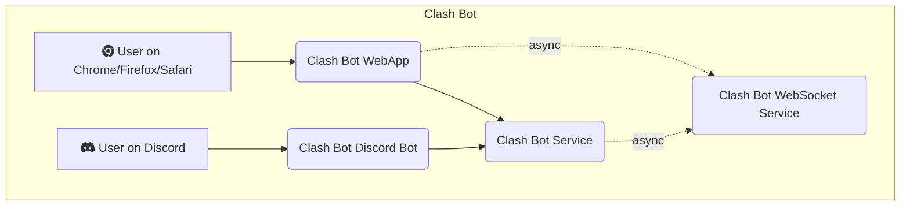

# Clash Bot Infrastructure

## Summary
A repo setup to handle shared Infrastructure with Clash Bot

:)

## Clash Bot Flowchart

```mermaid
flowchart TD
    user["fab:fa-chrome User on Chrome/Firefox/Safari"]
    userDiscord["fab:fa-discord User on Discord"]
    cbwa(Clash Bot WebApp)
    cbdb(Clash Bot Discord Bot)
    cbos(Clash Bot Service)
    cbwss(Clash Bot WebSocket Service)
    subgraph Clash Bot
        user --> cbwa
        userDiscord --> cbdb
        cbwa --> cbos
        cbwa -.async.-> cbwss
        cbos -.async.-> cbwss
        cbdb --> cbos
    end
```
